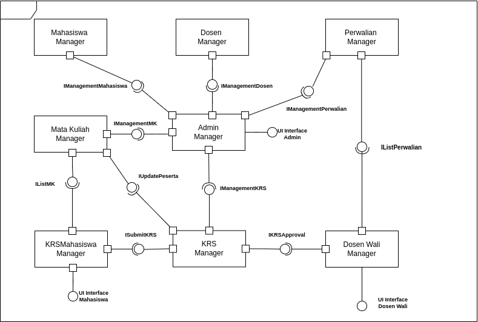
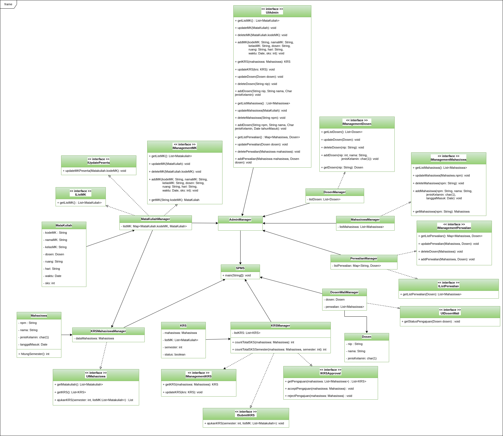

# 📚 SPMS - Study Plan Management System

## 📝 UTS Perangkat Lunak Berbasis Komponen

## ✨Kelompok 23 ✨

| Name            | NPM           |
| --------------- | ------------- |
| Furqan Ramadhan | 2108107010013 |
| Diky Wahyudi    | 2108107010031 |

---

## 📖 What is SPMS?

SPMS (Study Plan Management System) is a Java-based desktop application designed to streamline and manage the process of course registration (KRS), student management, academic advising, and course administration within an academic institution. It is inspired by the **KRS System of Universitas Syiah Kuala (USK)**.

---

## 🎯 Purpose

The purpose of this application is to provide a centralized system that allows administrators, students, and academic advisors (dosen wali) to interact effectively in managing study plans. This includes submitting, reviewing, and approving course registration forms (KRS), managing student data, lecturer assignments, and course schedules.

---

## ✨ Features

### 🧑‍🎓 For Students (Mahasiswa)

- View available courses
- Create and submit KRS
- See KRS approval status

### 👨‍🏫 For Academic Advisors (Dosen Wali)

- View students' KRS submissions
- Accept or reject KRS based on academic criteria

### 🛠️ For Admin

- Add, update, and delete course data
- Add, update, and delete student data
- Add, update, and delete lecturer data
- Assign academic advisors
- Manage course schedules
- View and update student KRS

---

## 📊 System Design Diagrams

### ⚙️ Component Diagram

The component diagram illustrates how various modules interact within the system:

- **Mahasiswa Manager**, **Dosen Manager**, and **Perwalian Manager** handle respective user and advisory data.
- **Admin Manager** acts as the central controller.
- **KRS Manager** and **KRS Mahasiswa Manager** manage course registration (KRS) from both admin and student sides.
- UI components connect to business logic through well-defined interfaces.

---

### 👤 Use Case Diagram

This diagram defines the system's main functionalities from a user's perspective:

- **Mahasiswa** can:

  - View course listings.
  - Fill and submit the KRS.

- **Dosen Wali** (Academic Advisor) can:

  - Review submitted KRS.
  - Approve or reject the student course plan.

- **Admin** manages the system:
  - Maintain user and course data.
  - Oversee all KRS and perwalian records.

---

### 🗂 Class Diagram

The class diagram gives an overview of how data and operations are structured:

- **Entities** like `Mahasiswa`, `Dosen`, `MataKuliah`, and `KRS` represent real-world data.
- **Manager Classes** such as `AdminManager`, `KRSManager`, and `PerwalianManager` perform operations like create, update, and delete.
- **Interfaces** enforce structure and consistency across modules.

💡 Right-click on the image and select "Open in new tab" to zoom in for a better view.

---

---

## 🔧 Technologies Used

- `Java JDK 11` (Java Development Kit)
- `Draw Io` (for system modeling)
- `java.util.*` (for Date, List, ArrayList, etc.)
- `Visual Studio Code` (for Code Editor)

---

## 🛠 How to Run

1. Clone or download this repository.
2. Open the project in your favorite Java IDE (e.g., IntelliJ IDEA, NetBeans, Code, etc).
3. Compile the project using the `makefile` provided: This will automatically compile and run the main file.
4. Follow the CLI prompts to operate as a **Student**, **Dosen Wali**, or **Admin**.

## 🙌 Acknowledgments

Special thanks to our lecturer and all contributors who supported this project.  
Inspired by the actual KRS system at Universitas Syiah Kuala.
