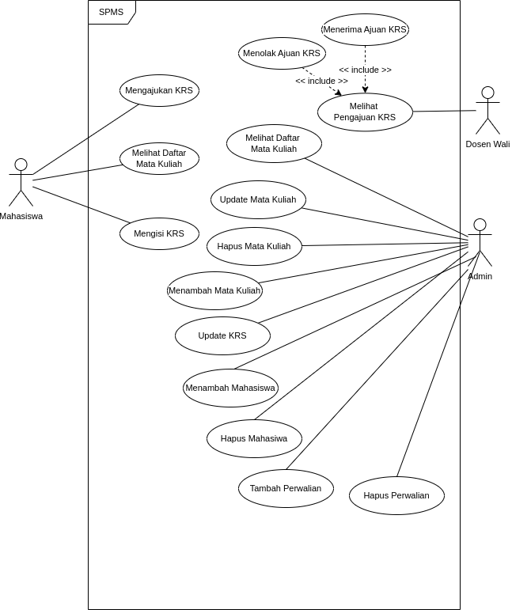

# 📚 SPMS - Study Plan Management System

## 📝 UTS Perangkat Lunak Berbasis Komponen

## ✨Kelompok 23 ✨

| Name            | NPM           |
| --------------- | ------------- |
| Furqan Ramadhan | 2108107010013 |
| Diky Wahyudi    | 2108107010031 |

---

## 📖 What is SPMS?

SPMS (Study Plan Management System) is a Java-based desktop application designed to streamline and manage the process of course registration (KRS), student management, academic advising, and course administration within an academic institution. It is inspired by the **KRS System of Universitas Syiah Kuala (USK)**.

---

## 🎯 Purpose

The purpose of this application is to provide a centralized system that allows administrators, students, and academic advisors (dosen wali) to interact effectively in managing study plans. This includes submitting, reviewing, and approving course registration forms (KRS), managing student data, lecturer assignments, and course schedules.

---

## ✨ Features

### 🧑‍🎓 For Students (Mahasiswa)

- View available courses
- Create and submit KRS
- See KRS approval status

### 👨‍🏫 For Academic Advisors (Dosen Wali)

- View students' KRS submissions
- Accept or reject KRS based on academic criteria

### 🛠️ For Admin

- Add, update, and delete course data
- Add, update, and delete student data
- Add, update, and delete lecturer data
- Assign academic advisors
- Manage course schedules
- View and update student KRS

---

## 📐 System Design

### ⚙️ Component Diagram

The component diagram shows how different modules such as UI, business logic, and data management interact within the system.

### 👤 Use Case Diagram

Describes the system functionalities available to different users:

- Mahasiswa: view courses, submit KRS
- Dosen Wali: review and approve/reject KRS
- Admin: full management access

 

### 🗂 Class Diagram

The class diagram includes key entities such as `Mahasiswa`, `Dosen`, `MataKuliah`, `KRS`, and manager classes like `AdminManager`, `KRSManager`, and `PerwalianManager`. `Right click` for zoom into details

---

## 🔧 Technologies Used

- `Java JDK 11` (Java Development Kit)
- `Draw Io` (for system modeling)
- `java.util.*` (for Date, List, ArrayList, etc.)
- `Visual Studio Code` (for Code Editor)

---

## 🛠 How to Run

1. Clone or download this repository.
2. Open the project in your favorite Java IDE (e.g., IntelliJ IDEA, NetBeans, Code, etc).
3. Compile the project using the `makefile` provided: This will automatically compile and run the main file.
4. Follow the CLI prompts to operate as a **Student**, **Dosen Wali**, or **Admin**.

## 🙌 Acknowledgments

Special thanks to our lecturer and all contributors who supported this project.  
Inspired by the actual KRS system at Universitas Syiah Kuala.
